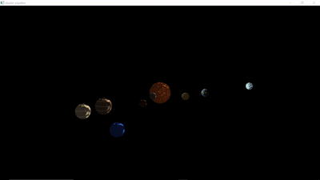

# Solar System Shader Pipeline



## Personal Information
- **Full Name:** Shabornee Saha
- **UtorID:** sahashab
- **Student Number:** 1008200803
- **Assignment Augmented:** Assignment 6 (A6)

## Instructions

To run this solar system shader pipeline:

1. **Clone the repository:**
   ```bash
   git clone https://github.com/ohnooj/computer-graphics-shader-pipeline.git
   ```

2. **Replace source files:**
   Replace all source files with the provided shader files and main.cpp

3. **Build the project:**
   ```bash
   mkdir build
   cd build
   cmake ..
   ```

4. **Build the solution:**
   Build the generated solution file 

5. **Run the program:**
   ```bash
   ./shaderpipeline ../data/test-08.json
   ```

## Description

A realistic solar system simulation using OpenGL shaders with dynamic textures, individual rotations, and lighting effects. Features the Sun and 8 planets with unique visual characteristics orbiting around the Sun and individual planet rotation.

### Key Features:
- **Complete Solar System:** Sun + 8 planets with individual rotations and orbital motion
- **Unique Planet Textures:** Each planet has distinct colors and surface patterns
- **Realistic Lighting:** Blinn-Phong shading with orbiting light source
- **Implementation:** `main.cpp`, `src/model.glsl`, `src/planet.fs`

## Acknowledgements

- **Base Framework:** Built upon my Assignment 6 submission for CSC317
- **Teaching Team:** CSC317 teaching team for the lab setup and shader pipeline framework
- **Planetary Data Reference:** Orbital distances and characteristics referenced from NASA's Scale Solar System guide: https://www.jpl.nasa.gov/_edu/pdfs/scaless_reference.pdf
- **Graphics Libraries:** 
  - OpenGL for rendering

Running `./shaderpipeline ../data/test-08.json` should display a creative planet
scene. For example: 


